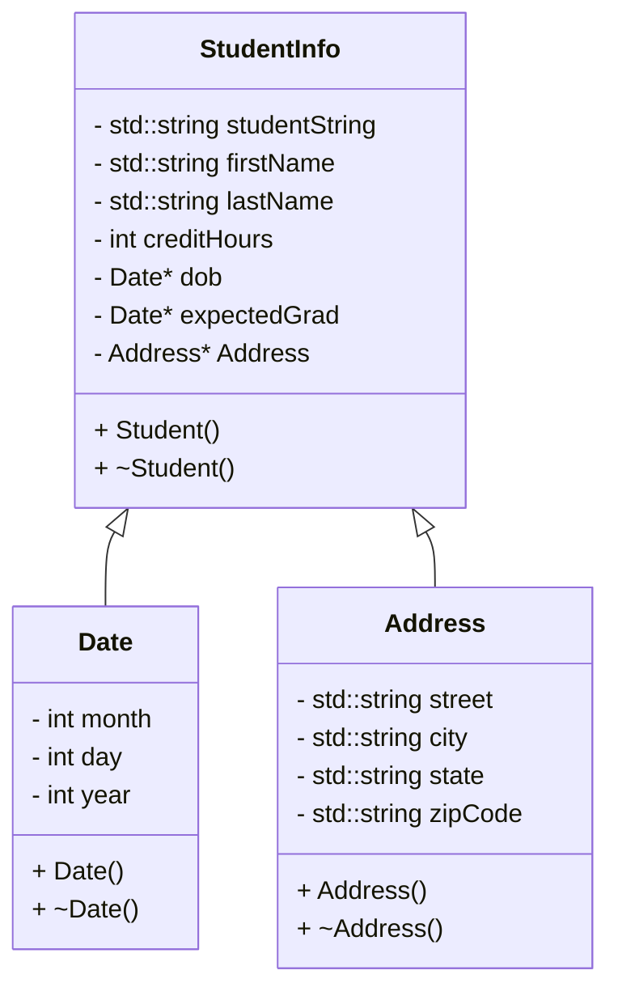

# Lab6_HeapOfStudentsPt1

```mermaid

%% Need Inits

classDiagram
    StudentInfo <|-- Date
    StudentInfo <|-- Address
    class StudentInfo{
      - std::string studentString
      - std::string firstName
      - std::string lastName
      - int creditHours
      - Date* dob
      - Date* expectedGrad
      - Address* Address
      + Student()
      + ~Student()
    }
    class Date{
      - int month
      - int day
      - int year
      + Date()
      + ~Date()    
    }
    class Address{
      - std::string street
      - std::string city
      - std::string state
    %%Don't need string even though it's a number, no math
      - std::string zipCode
      + Address()
      + ~Address()
    }

```
